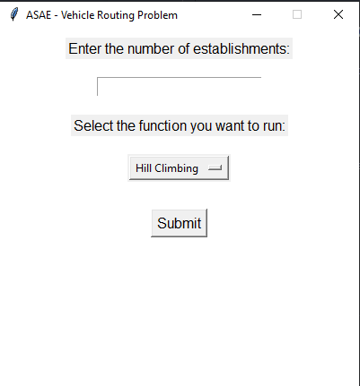
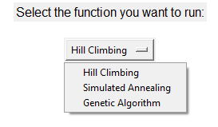
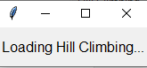
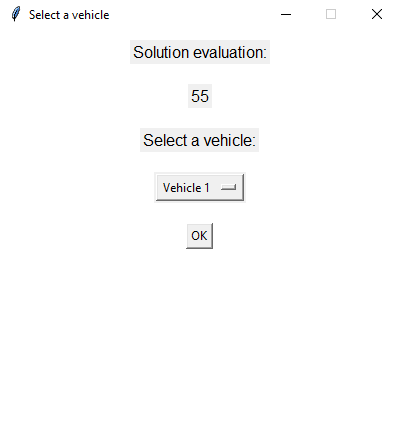
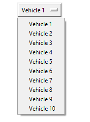
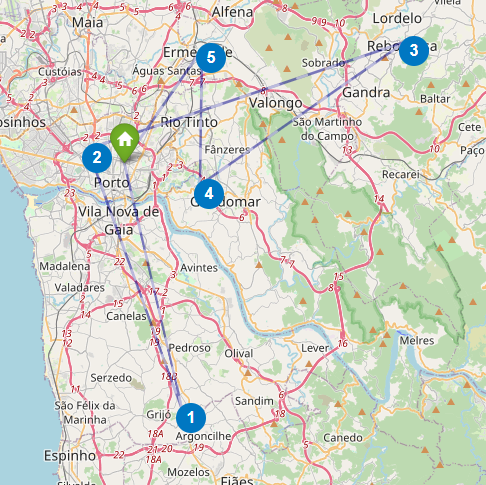

# IA Firt Assignment

# Optimal Inspection Routes Problem

# Problem : Inspected establishments maximization

## Installing the dependencies

- To run the project you need to have the following modules installed:
- Pandas (https://pandas.pydata.org/)
```bash
pip install pandas
```
- Matplotlib (https://matplotlib.org/)
```bash
pip install matplotlib
```
- Numpy (https://numpy.org/)
```bash
pip install numpy
```
- Tkinter (https://docs.python.org/3/library/tkinter.html)
```bash	
pip install tk
```
- Folium (https://python-visualization.github.io/folium/)
```bash
pip install folium
```

## Running the project
- To run the project you need to run the following command:
```bash
python3 main.py
```
- After running the command, the following window will appear:



- On the first input you need to insert the size of the dataset you want to use. The dataset is composed by 1000 establishments, so you can choose a number up to 1000.
- On the second input you need to choose the metaheuristic you want to use. You can choose between:
    - Hill Climbing
    - Simulated Annealing
    - Genetic Algorithm



- After choosing the metaheuristic, you need to click on the "Submit" button. After that a loading screen will appear and the program will run the metaheuristic.



- In the terminal we can see the inicial solution evaluation, and every time the solution is updated, we can see the new solution evaluation.
- In the end it is also shown the solution itself, with the establishments assigned to each vehicle.
- When the program finishes running the metaheuristic, the following window will appear:



- There we can see the number of establishments that were inspected, our final solution evaluation.
- We can also see each vehicle route, on the map, with the establishments assigned to it, by clicking on the ok button, after selecting the vehicle we want to see the route.



- This is an example of a vehicle route, shown on the map, on your default browser.

